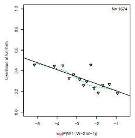

```{r libraries, echo=FALSE, message=FALSE, warning=FALSE}
library(directlabels)
library(dplyr)
library(knitr)

source("summary-spring-2018-helpers.R")
```

# Deriving efficient communication behavior in rational pragmatic agents

# Abstract
The combinatorial expressivity of natural language allows speakers to communicate about an unbounded set of potential meanings using a finite lexicon. But, by this same mechanism, a speaker may be confronted with multiple forms to express just a single meaning. How do speakers choose which form to use? Theories emphasizing communicative efficiency suggest rational speakers should attempt to optimize communicative properties of their utterances (Aylett & Turk, 2004; Levy & Jaeger, 2007; Genzel & Charniak, 2002). We evaluate the hypothesis that efficient production signatures arise from rational pragmatic agents and propose agent- and language-level features necessary to derive these signatures. We adopt a computational approach -- simulating production behavior in pragmatic agents while manipulating agent- and language-level components of interest.

# Introduction

The combinatorial expressivity of natural language allows speakers to communicate about an unbounded set of potential meanings using a finite lexicon. But, by this same mechanism, a speaker may be confronted with multiple forms to express just a single meaning. At least two questions emerge from this observation: How do speakers choose which forms to use? And how does the accumulation of these choices give rise to statistical patterns found in natural language?

A subset of functionalist approaches to language science emphasize communicative efficiency as a guiding principle for production behavior (beginning with Zipf, 19XX). In particular, theories such as the Smooth Signal Redundancy Hypothesis (SSRH) (Aylett & Turk, 2004), Uniform Information Density (UID) (Levy & Jaeger, 2007; Jaeger, 2010) and the Constant Entropy Rate Hypothesis (CER) (Genzel & Charniak, 2002; Xu & Reitter, 2018) frame communication in more general information theoretic terms -- if speakers are rational they should choose forms that optimize communicative properties of their utterances (Levy & Jaeger, 2007). 

Evidence for these hypotheses have largely been taken from observational studies of naturalistic corpora, focusing on empirical measurements of "optimal" behavior at signature **linguistic choice-points**. While such evidence is compelling in its scope across levels of production, a question remains -- why do speakers behave optimally?

We evaluate the hypothesis that efficient production signatures arise from rational pragmatic agents and describe the agent- and language-level features necessary to derive these signatures. We adopt a computational approach -- simulating production behavior in pragmatic agents while manipulating agent- and language-level features. 

We begin with an introduction to the subset of functionalist theories which frame aspects of production behavior in light of efficiency, highlighting the empirical signatures of each theory. We then present a rational-pragmatic interpretation of these behaviors. Next we introduce the basic form of the family of computational pragmatics models we adopt in this study and then outline the particular extensions used in subsequent simulations. Following the sequence of simulations we discuss the necessary ingredients required to generate efficient behavior, linking these to previous work. We end with a summary of our findings and proposal for next steps.

# Optimal speaker production

### Introduction

To what extent is language organized around efficiency? Zipf's (1939) observation that more frequently occuring words tend to have shorter forms served as the basis for perhaps the earliest analysis of languge design in terms of efficiency. Subsequent theories have extended this anlaysis showing that word length is better predicted by a word's average predictability in context (Piantadosi, Tilly & Gibson, 2009). The link between communicative efficiency and linguistic form is now seen as a compelling source of explanation at multiple time-courses of speaker production. 

For example, Aylett & Turk (2004) showed that word predictability had significant impacts on production behavior at the level phonological detail and duration. Speakers appeared to manage the amount of information encoded in a linguistic signal, attempting to avoid extreme peaks or troughs in their signal. [PERHAPS MORE HERE INTRODUCING THE IDEA OF A LINGUISTIC CHOICE POINT] While further evidence for optimal articulatory beahvior, Levy & Jaeger (2007) began in investigate a similar theory instead focusing on linguistic choice-points at the level of syntax.

### Uniform Information Density (Levy & Jaeger, 2007; Jaeger, 2010, OTHERS)




  * Choice point - syntax / relative clauses

### Constant Entropy Rate Hypothesis (Genzel & Charniak, 2002; OTHERS)

If communication is optimal (efficient) then the most efficient way to send information is a constant rate.


  * Choice point - discourse

## Re-interpreting UID and CER in rational-pragmatic terms

# Rational Speech-act Theory

## Basic model

A literal listener evaluates the truth-functional semantics of an utterance $u$ in proportion to the set of relevant utterances in the lexicon. Note that this base listener does not take the previous history of utterances $D$ into consideration.
$$L_0(m |u) \propto \delta(u)P(m)$$

The lowest level speaker chooses an utterance in proportion to the expected utility such that a listener will infer the correct intended meaning given that utterance.
$$S_n(u|m) \propto \exp(-\alpha(-log(L_{n-1}(m|u)) - cost(u)))$$

# Simulations

## UID-effects

### Model (Noisy RSA)

The literal listener evaluates an utterance with respect to their literal meanings $\delta(\cdot)$. Because noise $P_{noise}(\cdot)$ will sometimes corrupt the speakers utterances, the listener evaluates the likely intended utterance, inferred in the context of noise.
$$L_{0}(m|u_p) \propto P(m) \sum_{u_i}\delta(u_i, m)P_{\text{noise}}(u_i|u_p)$$

where $\delta(u_i, m) = True$ if $m \in [[u_i]]$.

Higher-order speakers choose utterances $u$ in accordance with their expected utility $\mathbb{U}(u;m)$ that a listener will recover the intended meaning $m$, while minimizing cost $cost(u)$.
$$S_n(u|m) \propto e^{\alpha\mathbb{U(u;m)}}$$
where the speaker is aware that noise may corrupt their intended utterance $u_i$ and the listener will need to recover that intended utterances from the produced utterance $u_p$.
$$\mathbb{U}(u;m) = \sum_{u_p}log(L_{n-1}(m|u_p))\times P_{\text{noise}}(u_p|u_i) - \text{cost}(u_i))$$
Higher-order listeners infer the intended meaning $m$ of an utterance $u$ by inferring the likely intended utterance $u_i$ given the possibility of noise.
$$L_{n}(m|u_p) \propto P(m) \sum_{u_i}S_{n}(u_i|m)P_{\text{noise}}(u_i|u_p)$$ 

### Results

#### Result 1: Speakers mark high-surprisal utterances

```{r plot1-setup, warning=FALSE, message=FALSE, echo=FALSE}
# Get model file
noisy_rsa_production_model <- getModelFile("/Users/benpeloquin/Desktop/Projects/rsa_uid/Models/fyp-presentation/noisy-rsa-production-model.wppl")
noisy_rsa_production_model_run_fn <- createRunFn(noisy_rsa_production_model)
basic_rsa_production_model <- getModelFile("/Users/benpeloquin/Desktop/Projects/rsa_uid/Models/fyp-presentation/basic-rsa-production-model.wppl")
basic_rsa_production_model_run_fn <- createRunFn(basic_rsa_production_model)
```


```{r plot1-data, warning=FALSE, message=FALSE, echo=FALSE}
THETA <- 0.2
ALPHA <- 6
LAMBDA <- 1
inputs <- c('a', 'b', 'c', 'd')
df_plot1 <- data.frame()
for (i in inputs) {
  runData <- data.frame(modelName='S3',
                       input=i,
                       alpha=ALPHA,
                       lambda=LAMBDA,
                       theta=THETA)
  currNoise <- noisy_rsa_production_model_run_fn(runData, 'rData') %>%
    mutate(modelType='noise',
           input=i)
  currBasic <- basic_rsa_production_model_run_fn(runData, 'rData')  %>%
    mutate(modelType='basic',
           input=i)
  df_plot1 <- rbind(df_plot1, rbind(currNoise, currBasic))
}
```

Speaker is more likely to use cue when the intended object is high surprisal.
```{r plot1, warning=FALSE, message=FALSE, echo=FALSE}
df_plot1$support <- factor(df_plot1$support, levels=c("a", "X a", "b", "X b", "c", "X c", "d", "X d"))
# Suprisal vals for plotting
surprisals <- data.frame(input=as.character(c('a', 'b', 'c', 'd')), 
                         vals=c(0.2, 0.5, 1, 2.5)) %>%
  mutate(normed_vals=vals/sum(vals),
         surprisal=-log2(normed_vals))
# Plot
left_join(df_plot1, surprisals, by=c('input'='input')) %>%
  mutate(referent=ifelse(support %in% c('X a', 'a'), 'a', 
                         ifelse(support %in% c('X b', 'b'), 'b',
                                ifelse(support %in% c('X c', 'c'), 'c', 
                                       ifelse(support %in% c('X d', 'd'), 'd', 'none')))),
         marked=grepl('X', support)) %>%
  filter(referent==input, marked) %>%
  ggplot(aes(x=paste0(referent, ' (', round(surprisal, 2), ')'), y=prob)) +
    geom_bar(aes(fill=modelType), position='dodge', stat='identity') +
    xlab("object (-log(P(object))") +
    ylab("Likelihood of UID cue") +
    theme_few()
```

#### Result 2: Listener infer oncoming item is high-surprisal given cue

```{r plot2-data, warning=FALSE, message=FALSE, echo=FALSE}
THETA <- 0.3
ALPHA <- 1
LAMBDA <- 16
currInput <- 'X'

runData <- data.frame(modelName='L1',
                     input=currInput,
                     alpha=ALPHA,
                     lambda=LAMBDA,
                     theta=THETA)

df_noisy_plot2 <- noisy_rsa_production_model_run_fn(runData, 'rData') %>%
  mutate(modelType='noise',
         input=currInput)
df_basic_plot2 <-  basic_rsa_production_model_run_fn(runData, 'rData')  %>%
  mutate(modelType='basic',
         input=currInput)

df_plot2 <- rbind(df_noisy_plot2, df_basic_plot2)
```

Listener is more likely to infer that oncoming material is high-surprisal given a cue.
```{r plot2, warning=FALSE, message=FALSE, echo=FALSE}
# Plot
left_join(df_plot2, surprisals, by=c('d'='input')) %>%
  ggplot(aes(x=paste0(d, ' (', round(surprisal, 2), ')'), y=prob, fill=modelType)) +
    geom_bar(stat='identity', position='dodge') +
    xlab("object (-log(P(object))") +
    ylab("p(obj|UID-cue)") +
    theme_few()
```
  
#### Result 3: Corpus analysis reflects UID relationship between likelihood to mark and surprisal
```{r plot3-setup, warning=FALSE, message=FALSE, echo=FALSE}
plot3NoiseModelFile <- "/Users/benpeloquin/Desktop/Projects/rsa_uid/Models/fyp-presentation/noisy-rsa-corpus-model.wppl"
plot3BasicModelFile <- "/Users/benpeloquin/Desktop/Projects/rsa_uid/Models/fyp-presentation/basic-rsa-corpus-model.wppl"
# plot3ModelFile <- "/Users/benpeloquin/Desktop/Projects/rsa_uid/Models/testing/noisy-rsa1-corpus.wppl"
```

```{r plot3-data, warning=FALSE, message=FALSE, echo=FALSE}
THETA <- 0.2
ALPHA <- 6
LAMBDA <- 1
nUtterances <- 2000
nSims <- 100

# Noise model
df_nrsa_corpus <- corpus_run_fn(plot3NoiseModelFile, "S4", ALPHA, LAMBDA, THETA, nUtterances, nSims) %>%
  mutate(model='noisy_rsa')
# Base model
df_brsa_corpus <- corpus_run_fn(plot3BasicModelFile, "S4", ALPHA, LAMBDA, THETA, nUtterances, nSims)  %>%
  mutate(model='basic_rsa')
# Combine
df_plot3 <- rbind(df_nrsa_corpus, df_brsa_corpus)
```

```{r plot3-rsa-uid-corpus-analysis, warning=FALSE, message=FALSE, echo=FALSE}
df_plot3 %>%
  ggplot(aes(x=avgPostProb, y=avgLikelihood, col=model)) +
      geom_line(lty=2, alpha=0.7) +
      geom_errorbar(aes(ymax=ymax, ymin=ymin, width=0)) +
      geom_errorbarh(aes(xmax=xmax, xmin=xmin, height=0)) +
      xlab("Language model surprisal (log( P( u1 | u2 )))") +
      ylab("Likelihood of full form") +
      ylim(0, 1) +
      ggtitle(paste0(nSims, " corpus simulations (", nUtterances, " utterances)", "\n95% boostrapped CIs.")) +
      theme_few() +
      theme(plot.title = element_text(hjust = 0.5))
```

# RSA-UID sensitivity analysis
```{r run-sensitivity-analysis, warning=FALSE, message=FALSE, echo=FALSE}
noiseModelFile <- "/Users/benpeloquin/Desktop/Projects/rsa_uid/Models/fyp-presentation/noisy-rsa-corpus-model.wppl"
THETA <- 0.2
LAMBDA <- 1
nUtterances <- 100
nSims <- 30

models <- c("S1", "S2", "S3", "S4")
thetas <- seq(0.1, 0.9, by=0.1)
alphas <- c(1, 3, 6, 12, 24)

df_sensitivity = data.frame()
for (m in models) {
  for (t in thetas) {
    for (a in alphas) {
      cat("\nmodel:", m, "alpha", a, 'theta', t)
      curr_run <- corpus_run_fn(noiseModelFile, m, a, LAMBDA, t, nUtterances, nSims, FALSE, FALSE)
      df_raw <- curr_run[[1]]
      df_processed <- run_corpus_analysis(df_raw, runSummarise=FALSE) %>%
        mutate(model=m,
               alpha=a,
               theta=t)
      df_sensitivity <- rbind(df_sensitivity, df_processed)
    }
  }
}
```

```{r sensitivity-analysis, warning=FALSE, message=FALSE, echo=FALSE}
# write.csv(df_sensitivity, file="df_sensitivity-20180423.csv")
df_heat <- df_sensitivity %>%
  group_by(model, alpha, theta) %>%
  summarise(correl=cor(postProb, lik))
```

```{r plot-sensitivity-analysis, warning=FALSE, message=FALSE, echo=FALSE}
plt_sensitivity <- df_heat %>%
  ungroup %>%
  mutate(alpha=as.factor(alpha),
         theta=as.factor(theta)) %>%
  ggplot(aes(theta, alpha)) +
    geom_tile(aes(fill=correl)) +
    scale_fill_gradient(low="red", high="white") +
    facet_wrap(~model) +
    theme_few()

ggsave("plots/uid-plot-sensitivity.png", plot=plt_sensitivity, device='png', width=8, height=4)
```

## CER-effects

  * Unconditional entropy $H(X|L)$ should increase with sentence position.
  * [SECONDARY MAYBE DON'T INCLUDE] $H(Y)$ remains constant over discourse.

### Model (Ambiguity+Topic RSA)

NOTE: Just refer to basic RSA model for low-level listener / speaker.

A literal listener evaluates the truth-functional semantics of an utterance $u$ in proportion to the set of relevant utterances in the lexicon. Note that this base listener does not take the previous history of utterances $D$ into consideration.
$$L_0(m |u) \propto \delta(u)P(m)$$

The lowest level speaker chooses an utterance in proportion to the expected utility such that a listener will infer the correct intended meaning given that utterance.
$$S_1(u|m) \propto \exp(-\alpha(-log(L_0(m|u)) - cost(u)))$$

Higher orders listeners jointly infer the meaning $m$ of the current utterance $u$ as well as the topic under discussion $T$ taking into account the complete discourse history $D$.
$$L_{1}(m, T|u, D) \propto S_1(u|m)P(m|T)P(T|D)$$
where the listener updates there posterior over topics given the complete history of utterances made by the speaker.
$$P(T|D) \propto P(T)\prod_{i}^{|D|}S_{n-1}(u_i|w_i)P(w_i|T)$$
Higher order speakers choose an utterance $u$ in accordance to the expected utility of using that utterance to convey a particular meaning $m$ within the context of a particular topic $T$ and the complete discourse history $D$.
$$S_{2}(u|w, T, D) \propto \mathbb{U}[u, T ;w, D]$$

$$\mathbb{U}[u, T;w, D] = \exp(-\alpha(log(L_2(m|u,T))P(T|D)-cost(u)))$$

### Results

#### Result 1: Listener gradually infers topic

```{r plot4-setup-ambiguity-model, warning=FALSE, message=FALSE, echo=FALSE}
fAmbiguityModelPath <- '/Users/benpeloquin/Desktop/Projects/rsa_uid/Models/fyp-presentation/ambiguity-corpus-model.wppl'
model_ambiguity <- getModelFile(fAmbiguityModelPath)

runAmbiguity <- createRunFn(model_ambiguity)
runAmbiguityFn <- function(i, targetDistr, nUtterances, resultType, alpha, recursionLevel) {
  dTemp <- data.frame(targetDistr=targetDistr, 
                      nUtterances=nUtterances, 
                      resultType=resultType, 
                      alpha=alpha, 
                      recursionLevel=recursionLevel)
  df <- runAmbiguity(dTemp) %>%
    mutate(runNum=i, targetDistr=targetDistr, alpha=alpha, resultType=resultType, recursionLevel=recursionLevel)
  df
}
```

```{r plot4-run-simulations, warning=FALSE, message=FALSE, echo=FALSE}
alpha <- 10
topic <- 'T1'
nUtterances <- 40
recursionLevel <- 2

df_baseline <- runAmbiguityFn(1,
                              targetDistr=topic,
                              nUtterances=nUtterances,
                              resultType='baseline',
                              alpha=alpha,
                              recursionLevel=recursionLevel)
df_contextUnaware <- runAmbiguityFn(1,
                                    targetDistr=topic,
                                    nUtterances=nUtterances,
                                    resultType='contextUnaware',
                                    alpha=alpha,
                                    recursionLevel=recursionLevel)
df_contextAware <- runAmbiguityFn(1, 
                                  targetDistr=topic, 
                                  nUtterances=nUtterances, 
                                  resultType='contextAware', 
                                  alpha=alpha,
                                  recursionLevel=recursionLevel)

df_SBasic <- runAmbiguityFn(1, 
                            targetDistr=topic, 
                            nUtterances=nUtterances, 
                            resultType='S', 
                            alpha=alpha,
                            recursionLevel=recursionLevel)

df_amb <- rbind(df_contextAware, df_baseline)
```

Note (BP 20180408): Instead of binning within a run, why not calculate entropy between runs (so if we have 200 simulations check entropy of position 1.)

First plot -- just speaker utterances across a single discourse.
```{r plot4a-rsa-CER-listeners-learn-topic, warning=FALSE, message=FALSE, echo=FALSE}
lvls <- as.factor(df_amb$utterance)

df_ambg_plot4 <- df_amb %>%
  rowwise() %>%
  mutate(utteranceYPos=which(utterance==levels(lvls))/10,
         resultType=ifelse(resultType=='baseline', 'Baseline',
                           ifelse(resultType=='contextUnaware', 'Context Unaware', 'Context Aware')),
         resultType=factor(resultType, levels=c('Baseline', 'Context Unaware', 'Context Aware')),
         utterance_name=ifelse(utterance=='a', 'Alex', 
                               ifelse(utterance=='b', 'Balloon',
                                      ifelse(utterance=='c', 'Cookie', 
                                             ifelse(utterance=='d', 'Pat',
                                                    ifelse(utterance=='x', 'they', 'it'))))),
         utterance_name=factor(utterance_name, levels=c("they", "it", "Alex", "Balloon", "Cookie", "Pat")))
cer_plt_1a <- df_ambg_plot4 %>%
  ggplot(aes(x=utteranceNum, y=utteranceYPos, col=utterance_name)) +
    geom_text(alpha=0.8, aes(label=utterance_name), position=position_jitter(height=0.25)) +
    # geom_line(aes(x=utteranceNum, y=T1), col='blue', size=1.5) +
    # geom_line(aes(x=utteranceNum, y=T2), col='red', alpha=0.25, size=1.5) +
    # geom_line(aes(x=utteranceNum, y=T3), col='green', alpha=0.25, size=1.5) +
    # geom_line(aes(x=utteranceNum, y=T4), col='purple', alpha=0.25, size=1.5) +
    ylab("Utterance") +
    xlab("Utterance position in discourse") +
    ylim(-0.5, 1) +
    xlim(0, 40) +
    theme_few() +
    theme(legend.position='none', plot.title = element_text(hjust = 0.5)) +
    ggtitle("Speaker utterances across discourse") +
    facet_wrap(~resultType, ncol=1)

cer_plt_1b <- df_ambg_plot4 %>%
  filter(utterance_name=='they') %>%
  # filter(utterance_name=='it' | utterance_name=='Alex') %>%
  ggplot(aes(x=utteranceNum, y=utteranceYPos, col=utterance_name)) +
    geom_text(alpha=0.8, aes(label=utterance_name), position=position_jitter(height=0.25)) +
    # geom_line(aes(x=utteranceNum, y=T1), col='blue', size=1.5) +
    # geom_line(aes(x=utteranceNum, y=T2), col='red', alpha=0.25, size=1.5) +
    # geom_line(aes(x=utteranceNum, y=T3), col='green', alpha=0.25, size=1.5) +
    # geom_line(aes(x=utteranceNum, y=T4), col='purple', alpha=0.25, size=1.5) +
    ylab("Utterance") +
    xlab("Utterance position in discourse") +
    ylim(-0.5, 1) +
    xlim(0, 40) +
    theme_few() +
    theme(legend.position='none', plot.title = element_text(hjust = 0.5)) +
    ggtitle("Speaker utterances across discourse") +
    facet_wrap(~resultType, ncol=1)

ggsave("plots/cer-plot-1a.png", plot=cer_plt_1a, device='png', width=8, height=4)
ggsave("plots/cer-plot-1b.png", plot=cer_plt_1b, device='png', width=8, height=4)
```

Second plot listener infers topic.
```{r plot4b-rsa-CER-listeners-learn-topic, warning=FALSE, message=FALSE, echo=FALSE}
first_above_90 <- which(subset(df_ambg_plot4, resultType=='Context Aware')$T1 > 0.9)[1]
df_vline <- data.frame(x_inter=first_above_90, resultType='Context Aware')

cer_plot_1c <- df_ambg_plot4 %>%
  ggplot(aes(x=utteranceNum, y=utteranceYPos, col=utterance_name)) +
    geom_text(alpha=0.5, aes(label=utterance_name)) +
    geom_line(aes(x=utteranceNum, y=T1), col='blue', size=1.5) +
    # geom_line(aes(x=utteranceNum, y=T2), col='red', alpha=0.25, size=1.5) +
    # geom_line(aes(x=utteranceNum, y=T3), col='green', alpha=0.25, size=1.5) +
    # geom_line(aes(x=utteranceNum, y=T4), col='purple', alpha=0.25, size=1.5) +
    ylab("P( topic | discourse )") +
    xlab("Utterance position in discourse") +
    ylim(0, 1) +
    theme_few() +
    theme(legend.position='none', plot.title = element_text(hjust = 0.5)) +
    ggtitle("Listener posterior over target topic")
ggsave("plots/cer-plot-1c.png", plot=cer_plot_1c, device='png', width=8, height=4)

cer_plot_1d <- df_ambg_plot4 %>%
  ggplot(aes(x=utteranceNum, y=T1, col=resultType)) +
    geom_line(size=1.5, alpha=0.8) +
    # geom_line(aes(x=utteranceNum, y=T2), col='red', alpha=0.25, size=1.5) +
    # geom_line(aes(x=utteranceNum, y=T3), col='green', alpha=0.25, size=1.5) +
    # geom_line(aes(x=utteranceNum, y=T4), col='purple', alpha=0.25, size=1.5) +
    ylab("P( topic | discourse )") +
    xlab("Utterance position in discourse") +
    ylim(0, 1) +
    theme_few() +
    theme(legend.position='none', plot.title = element_text(hjust = 0.5)) +
    ggtitle("Listener posterior over target topic")
ggsave("plots/cer-plot-1d.png", plot=cer_plot_1d, device='png', width=8, height=4)
```

```{r run-CER-sims-setup, warning=FALSE, message=FALSE, echo=FALSE}
runAmibguityCorpus <- function(topic, alpha, resultType, recursionLevel, nUtterances, nSims) {
  # Parallelization setup
  no_cores <- detectCores() - 1
  cl <- makeCluster(no_cores, type='FORK')
  registerDoParallel(cl)
  
  # Run sims
  ptm <- proc.time()
  sims <- foreach(i=seq(1, nSims), .packages=c('dplyr', 'rwebppl'), .combine=rbind) %dopar% 
    runAmbiguityFn(i,
                   targetDistr=topic,
                   nUtterances=nUtterances,
                   resultType=resultType,
                   alpha=alpha,
                   recursionLevel=recursionLevel)
  stopCluster(cl)
  etm <- proc.time() - ptm
  
  # Preprocess for entropy calculations.
  binSize <- 1
  df_binned <- addUtteranceBins(sims, nUtterances=nUtterances, binSize=binSize)
  df_filled <- fillUtteranceProportions(df_binned, binSize)
  list(sims, df_filled)
}
```

```{r run-CER-sims, warning=FALSE, message=FALSE, echo=FALSE}
TOPIC <- 'T1'
ALPHA <- 10
recursionLevel <- 2
nUtterances <- 40
nSims <- 250

# topic, alpha, resultType, recursionLevel, nUtterances, nSims
L_AmbiguityCorpusContextAware <- runAmibguityCorpus(TOPIC, ALPHA, 'contextAware', recursionLevel, nUtterances, nSims)
L_AmbiguityCorpusContextUnAware <- runAmibguityCorpus(TOPIC, ALPHA, 'contextUnaware', recursionLevel, nUtterances, nSims)
# L_AmbiguityCorpusSBasic <- runAmibguityCorpus(TOPIC, ALPHA, 'S', recursionLevel, nUtterances, nSims)
L_AmbiguityCorpusBaseline <- runAmibguityCorpus(TOPIC, ALPHA, 'baseline', recursionLevel, nUtterances, nSims)  

simsAmbiguityCorpusContextAware <- L_AmbiguityCorpusContextAware[[1]]
dfAmbiguityCorpusContextAware <- L_AmbiguityCorpusContextAware[[2]]

# simsAmbiguityCorpusContextUnAware <- L_AmbiguityCorpusContextUnAware[[1]]
# dfAmbiguityCorpusContextUnAware <- L_AmbiguityCorpusContextUnAware[[2]]

# simsAmbiguityCorpusSBasic <- L_AmbiguityCorpusSBasic[[1]]
# dfAmbiguityCorpusSBasic <- L_AmbiguityCorpusSBasic[[2]]

simsAmbiguityCorpusBaseline <- L_AmbiguityCorpusBaseline[[1]]
dfAmbiguityCorpusBaseline <- L_AmbiguityCorpusBaseline[[2]]

simsCmbd <- rbind(simsAmbiguityCorpusContextAware,
                  # simsAmbiguityCorpusContextUnAware,
                  # simsAmbiguityCorpusSBasic,
                  simsAmbiguityCorpusBaseline)
                  
dfAmbiguityCorpusCmbd <- rbind(dfAmbiguityCorpusContextAware, 
                               # dfAmbiguityCorpusContextUnAware, 
                               # dfAmbiguityCorpusSBasic, 
                               dfAmbiguityCorpusBaseline)
```


```{r plot4b-rsa-CER-listeners-learn-topic, warning=FALSE, message=FALSE, echo=FALSE, eval=FALSE}
# sims %>%
#   mutate(`P(Topic|Utterances)`=ifelse(utterance=='x' | utterance=='X x', 0.5, 
#                                       ifelse(utterance=='y' | utterance=='X y', 0.75, 0)),
#          utterance=ifelse(utterance=='x', '[a, d]', 
#                           ifelse(utterance=='X x', 'X[a, d]', 
#                                  ifelse(utterance=='y', '[b, c]', ifelse(utterance=='X y', 'X[b, c]', utterance))))) %>%
#   ggplot(aes(x=utteranceNum, y=`P(Topic|Utterances)`)) +
#     geom_smooth(method='loess', aes(y=T1)) +
#     geom_jitter(aes(col=utterance), width=0.5, height=0.1, alpha=0.25, size=2) +
#     ylab("Listener posterior probability of target topic") +
#     xlab("Utterance position") +
#     ggtitle(paste("S4 production (points) and listener topic inference (line)\nn=",nSims," simulations")) +
#     theme_few() +
#     theme(plot.title=element_text(hjust = 0.5))
```

#### Result 2: Speaker more likley to use ambiguous utterance once listener is confident in topic
```{r plot4-rsa-CER-speakers-more-likely-to-use-ambiguous-utterances, warning=FALSE, message=FALSE, echo=FALSE}
simsCmbd %>%
  group_by(resultType) %>%
  mutate(isAmbiguous=(utterance=='x' | utterance=='y'),
         isX=utterance=='x',
         isA=utterance=='a',
         isB=utterance=='b') %>%
  group_by(resultType, utteranceNum) %>%
  summarise(n=n(),
            numAmb=sum(isAmbiguous),
            probAmb=numAmb/n,
            stdAmb=sqrt(probAmb*(1-probAmb)/n),
            numX=sum(isX),
            probX=numX/n,
            stdX=sqrt(probX*(1-probX)/n),
            numA=sum(isA),
            probA=numA/n,
            stdA=sqrt(probA*(1-probA)/n),
            numB=sum(isB),
            probB=numB/n,
            stdB=sqrt(probB*(1-probB)/n),
            avgT1=mean(T1),
            avgT2=mean(T2),
            avgT3=mean(T3),
            avgT4=mean(T4)) %>%
  ungroup %>%
  # Check relations to other utterances here:
  # gather(type, val, c(probX, probA, probB)) %>%
  mutate(resultType=ifelse(resultType=='baseline', 'Baseline',
                           ifelse(resultType=='contextUnaware', 'Context Unaware', 'Context Aware')),
         resultType=factor(resultType, levels=c('Baseline', 'Context Unaware', 'Context Aware'))) %>%
  ggplot(aes(x=utteranceNum, y=probAmb)) +
    # geom_smooth(aes(y=avgT1), col='red', alpha=0.2) +
    # geom_smooth(aes(y=avgT2), col='green', alpha=0.2) +
    geom_point(size=2, alpha=0.75) +
    geom_smooth(method='loess', alpha=0.5, col='blue') +
    # geom_smooth(method = "lm", formula = y ~ poly(x, 2)) +
    geom_errorbar(aes(ymin=probAmb-2*stdAmb, ymax=probAmb+2*stdAmb), alpha=0.5, width=0) +
    ylab("Empirical probability \nof ambiguous utterance ['x', 'y']") +
    xlab("Utterance position") +
    ggtitle(paste0("Empirical probability Speaker uses ambiguous utterance\nn=", nSims," simulations")) +
    theme_few() +
    theme(plot.title=element_text(hjust = 0.5)) +
    facet_grid(~resultType)

ggsave("plots/cer-plot-2a.png", plot=last_plot(), device='png', width=8, height=4)
```

  
#### Result 3: Unconditional entropy effect

Resources:

* https://math.stackexchange.com/questions/2221096/can-conditional-entropy-hy-mid-x-be-expressed-by-kullback-leibler-divergence?utm_medium=organic&utm_source=google_rich_qa&utm_campaign=google_rich_qa
* https://ejde.math.txstate.edu/Volumes/2016/237/popescu.pdf
* https://en.wikipedia.org/wiki/Inequalities_in_information_theory#Lower_bounds_for_the_Kullback%E2%80%93Leibler_divergence
* https://en.wikipedia.org/wiki/Gibbs%27_inequality
* http://alumni.media.mit.edu/~bcroy/papers/bcroy_expected-entropy.pdf

See Genzel & Charniak (2002) footnote 2.
More specifically, what they're looking for is the cross entropy between all words at position $i$ and the true model of English to be the same for all $i$.

$$H_{cross}(X^{(i)}, C) = K = H(X^{(i)}) + D_{KL}(X^{(i)}||C)$$

```{r plot5-rsa-CER-unconditional-entropy-effect, warning=FALSE, message=FALSE, echo=FALSE}
# Note (BP): Manual calculation when listener knows topic.

dfAmbiguityCorpusCmbd %>%
  group_by(resultType, binVal, utterance) %>%
  summarise(cnt=sum(n),
            prop=cnt/nSims) %>%
  group_by(resultType, binVal) %>%
  summarise(`H(P(X))`=entropy::entropy.plugin(cnt, unit=c('log2'))) %>%
  ungroup %>%
  mutate(resultType=ifelse(resultType=='baseline', 'Baseline', 
                ifelse(resultType=='contextAware', 'Context Aware', 'Context Unaware')),
         resultType=factor(resultType, levels=c('Baseline', 'Context Unaware', 'Context Aware'))) %>%
  ggplot(aes(x=binVal, y=`H(P(X))`)) +
    geom_line(size=2, alpha=0.75, col='blue') +
    geom_smooth(method='loess', col='red', alpha=0.5, lty=2) +
    xlab("Utterance position i") +
    ylab("Unconditional entropy H(X_i)") +
    theme_few() +
    theme(legend.position="none") +
    facet_wrap(~resultType, ncol=3) +
    ggtitle(paste0("Unconditional entropy across discourse\nn=", nSims," simulations")) +
    theme(plot.title=element_text(hjust = 0.5))

ggsave("plots/cer-plot-2b.png", plot=last_plot(), device='png', width=8, height=4)
```
  
#### Result 4 [OPTIONAL]: $H(Y)$ remains constant across discourse

```{r plot6-rsa-CER-constant-entropy-full-effect, warning=FALSE, message=FALSE, echo=FALSE, eval=FALSE}
# Note (BP): Manual calculation when listener knows topic.
# steadyStateProps <- c(0.24525,	0.2565,	0.1386,	0.0449955,	0.3002045,	0.0135)
# 
# df_filled %>%
#   group_by(binVal, utterance) %>%
#   summarise(cnt=sum(n),
#             prop=cnt/nSims) %>%
#   group_by(binVal) %>%
#   summarise(`H(P(X))`=entropy::entropy.plugin(cnt, unit=c('log2')),
#             `KL divergence`=entropy::KL.empirical(cnt, steadyStateProps*nSims, unit=c('log2')),
#             `Cross entropy (H(P(X))+KL(P(X)||Q(X)))`=`H(P(X))`+`KL divergence`) %>%
#   gather(typ, measure, c(`H(P(X))`, `KL divergence`, `Cross entropy (H(P(X))+KL(P(X)||Q(X)))`)) %>%
#   ggplot(aes(x=binVal, y=measure, col=typ)) +
#     geom_line(size=2, alpha=0.5) +
#     annotate("text", label = "HCross(P, Q)", x=4, y = 2.1, size=4, col="red") +
#     annotate("text", label = "H(P)", x=8, y = 1.6, size= 4, col="forest green") +
#     annotate("text", label = "KL(P||Q)", x=10, y = 0.6, size= 4, col="blue") +
#     xlab("Utterance position i") +
#     ylab("Measure (bits)") +
#     theme_few() +
#     theme(legend.position="none")
```

## Combined model

### Model (Ambiguity+Topic Noisy RSA)

```{r plot6-setup-FULL-model, warning=FALSE, message=FALSE, echo=FALSE}
fFullModelPath <- '/Users/benpeloquin/Desktop/Projects/rsa_uid/Models/fyp-presentation/full-corpus-model.wppl'
model_full <- getModelFile(fFullModelPath)

runFull <- createRunFn(model_full)
runFullFn <- function(i, targetDistr, nUtterances, resultType, alpha, theta, recursionLevel) {
  dTemp <- data.frame(targetDistr=targetDistr, 
                      nUtterances=nUtterances, 
                      resultType=resultType, 
                      alpha=alpha, 
                      theta=theta,
                      recursionLevel=recursionLevel)
  df <- runFull(dTemp) %>%
    mutate(runNum=i, targetDistr=targetDistr, 
           alpha=alpha, theta=theta, resultType=resultType, recursionLevel=recursionLevel)
  df
}
```

```{r plot6-setup-FULL-model-par-run-fn, warning=FALSE, message=FALSE, echo=FALSE}
runFullCorpus <- function(topic, alpha, theta, resultType, recursionLevel, nUtterances, nSims) {
  # Parallelization setup
  no_cores <- detectCores() - 1
  cl <- makeCluster(no_cores, type='FORK')
  registerDoParallel(cl)
  
  # Run sims
  ptm <- proc.time()
  sims <- foreach(i=seq(1, nSims), .packages=c('dplyr', 'rwebppl'), .combine=rbind) %dopar% 
    runFullFn(i,
              targetDistr=topic,
              nUtterances=nUtterances,
              resultType=resultType,
              alpha=alpha,
              theta=theta,
              recursionLevel=recursionLevel)
  stopCluster(cl)
  etm <- proc.time() - ptm
  
  # Preprocess for entropy calculations.
  binSize <- 1
  df_binned <- addUtteranceBins(sims, nUtterances=nUtterances, binSize=binSize)
  df_filled <- fillUtteranceProportions(df_binned, binSize)
  list(sims, df_filled)
}
# topic, alpha, theta, resultType, recursionLevel, nUtterances, nSims
# runFullCorpus('T1', 10, 0.2, 'contextAware', 2, 40, 10)
```


```{r plot6-run-full-model, warning=FALSE, message=FALSE, echo=FALSE}
TOPIC <- 'T1'
ALPHA <- 10
THETA <- 0.2
RESULT_TYPE <- 'contextAware'
recursionLevel <- 2
nUtterances <- 100
nSims <- 100

# topic, alpha, theta, resultType, recursionLevel, nUtterances, nSims
full_model_sims <- runFullCorpus(TOPIC, ALPHA, THETA, RESULT_TYPE, recursionLevel, nUtterances, nSims)
full_sims <- full_model_sims[[1]]
df_filled_full <- full_model_sims[[2]]
```

```{r plot6a-use-of-ambiguous-items, warning=FALSE, message=FALSE, echo=FALSE}
full_sims %>%
  mutate(isAmbiguous=(utterance=='x' | utterance=='y'),
         isX=utterance=='x',
         isA=utterance=='a',
         isB=utterance=='b') %>%
  group_by(utteranceNum) %>%
  summarise(n=n(),
            numAmb=sum(isAmbiguous),
            probAmb=numAmb/n,
            stdAmb=sqrt(probAmb*(1-probAmb)/n),
            numX=sum(isX),
            probX=numX/n,
            stdX=sqrt(probX*(1-probX)/n),
            numA=sum(isA),
            probA=numA/n,
            stdA=sqrt(probA*(1-probA)/n),
            numB=sum(isB),
            probB=numB/n,
            stdB=sqrt(probB*(1-probB)/n),
            avgT1=mean(T1),
            avgT2=mean(T2),
            avgT3=mean(T3),
            avgT4=mean(T4)) %>%
  # Check relations to other utterances here:
  # gather(type, val, c(probX, probA, probB)) %>%
  # ggplot(aes(x=utteranceNum, y=val, col=type)) +
  ggplot(aes(x=utteranceNum, y=probAmb)) +
    # geom_smooth(aes(y=avgT1), col='red', alpha=0.2) +
    # geom_smooth(aes(y=avgT2), col='green', alpha=0.2) +
    geom_point(size=2, alpha=0.75) +
    geom_smooth(method='loess', alpha=0.5, col='blue') +
    # geom_smooth(method = "lm", formula = y ~ poly(x, 2)) +
    geom_errorbar(aes(ymin=probAmb-2*stdAmb, ymax=probAmb+2*stdAmb), alpha=0.5, width=0) +
    ylab("Empirical probability \nof ambiguous utterance ['x', 'y']") +
    xlab("Utterance position") +
    ggtitle(paste0("Empirical probability Speaker uses ambiguous utterance\nn=", nSims," simulations")) +
    theme_few() +
    theme(plot.title=element_text(hjust = 0.5))
```

```{r plot6b-unconditional-entropy, warning=FALSE, message=FALSE, echo=FALSE}
df_filled_full %>%
  group_by(binVal, utterance) %>%
  summarise(cnt=sum(n),
            prop=cnt/nSims) %>%
  group_by(binVal) %>%
  summarise(`H(P(X))`=entropy::entropy.plugin(cnt, unit=c('log2'))) %>%
  ggplot(aes(x=binVal, y=`H(P(X))`)) +
    geom_line(size=2, alpha=0.75, col='blue') +
    geom_smooth(method='loess', col='red', alpha=0.5, lty=2) +
    xlab("Utterance position i") +
    ylab("Unconditional entropy H(X_i)") +
    ggtitle(paste0("Unconditional sentence entropy estimates by position\nn=", nSims," simulations")) +
    theme_few() +
    theme(plot.title=element_text(hjust = 0.5))
```

````{r plot6c-negative-correlation, warning=FALSE, message=FALSE, echo=FALSE}
full_sims_lm <- full_sims %>%
  mutate(currUtterance=utterance,
         expNum=runNum) %>%
  process_sims(.) %>%
  run_corpus_analysis(., ci=0.90) %>%
  mutate(simType='full')
```

```{r}
full_sims_lm %>% 
  ggplot(aes(x=avgPostProb, y=avgLikelihood, col=as.factor(second))) +
    geom_point(size=2.5) +
    geom_errorbar(aes(ymax=ymax, ymin=ymin, alpha=0.2), width=0) +
    geom_errorbarh(aes(xmax=xmax, xmin=xmin, alpha=0.2), height=0) +
    xlab("Language model surprisal (log( P( u1 | u2 )))") +
    ylab("Likelihood of full form") +
    ylim(0, 1) +
    ggtitle(paste0(nSims, " corpus simulations (", nUtterances, " utterances)", "\n90% boostrapped CIs.")) +
    theme_few() +
    theme(plot.title=element_text(hjust = 0.5), legend.position='none')
```

## Results

```{r , warning=FALSE, message=FALSE, echo=FALSE}
behaviors <- c("Basic scalar implicature",
               "Speaker mark high-suprisal content",
               "Listener um-implicature",
               "Corpus UID effect",
               "Increase use of ambiguous utterances when context disambiguates",
               "Increase unconditional entropy over discourse")
ref <- c("Frank & Goodman (2012)",
         "Levy & Jaeger (2007), Jaeger (2010)",
         "Levy & Jaeger (2007), Jaeger (2010)",
         "Levy & Jaeger (2007), Jaeger (2010)",
         "Piantadosi (2012)",
         "Genzel & Charniak (2002)")
baseModel <- c("X", "", "", "", "", "")
rsaNoise <- c("X", "X", "X", "X", "", "")
rsaAmbiguity <- c("X", "", "", "", "X", "X")
fullModel <- c("X", "X", "X", "X", "X", "X")

df_table <- data.frame(behavior=behaviors,
                       reference=ref,
                       base_model=baseModel,
                       rsa_noise=rsaNoise,
                       rsa_ambiguity=rsaAmbiguity,
                       rsa_noise_ambiguity=fullModel) %>%
  rename('base model'=base_model,
         'rsa + noise'=rsa_noise,
         'rsa + ambiguity'=rsa_ambiguity,
         'rsa + noise + ambiguity'=rsa_noise_ambiguity)
  # filter(behavior != 'Basic scalar implicature')
```

```{r}
kable(df_table)
```
